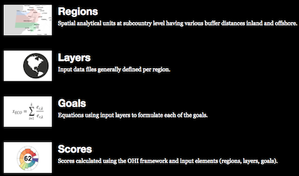

# sustainsb.github.io

Scientific data-driven website and calculation repo for SustainSB

This proof of concept SustainSB.github.io site demonstrates an open-source approach to calculating sustainability indices for Santa Barbara, setup initially by [Ben Best](http://ecoquants.com/about/#people) for a SustainSB meeting May 4, 2017 organized by Seth Streeter, Laura Capps and Dave Fortsen. We hope to create a digital dashboard for sustainability in Santa Barbara that will become a model for cities around the world that aligns with the United Nations Sustainable Development Goal [**11: Sustainable Cities and Communities**](https://sustainabledevelopment.un.org/sdg11#targets).

## Example of **Ocean Health Index** (OHI)

- public website: [OceanHealthIndex.org](http://www.oceanhealthindex.org/)
- science website: [OHI-science.org](http://ohi-science.org/)
- presentation: [Reproducible Science with the Ocean Health Index](http://benbestphd.com/talks/2014-06_OHI-repro-sci) (2014)
    - Example Gulf of Guayaqil [website](http://ohi-science.org/gye) & [files](https://github.com/ohi-science/gye)
    
- app: [Global OHI Explorer App](http://ecoquants.com/app/ohi) (2016)
- presentation: [Transforming how we approaching marine science for management](https://docs.google.com/presentation/d/1MW36Q3YO7ovL5RrhyMTzMtzA0oN4dJukpAsInsuC6Qs/edit#slide=id.g1dc9c1836e_0_81) (2017)

## Demo for **SustainSB**

The website is hosted for free on Github in a repository, a collection of versioned files:

- **website**: [sustainsb.github.io](https://github.com/sustainsb/sustainsb.github.io). This is a free public website.

- **files**: [github.com/sustainsb/sustainsb.github.io](https://github.com/sustainsb/sustainsb.github.io). This repository holds the versioned files. Anyone can download, or copy and contribute, ie [fork and pull request](https://guides.github.com/activities/forking/).

A typical process for arriving at sustainability indices involves these steps:

- [**prep_regions**](https://sustainsb.github.io/prep_regions.html). The regions make up the fundamental spatial units of analysis for associating data layers and goal scores.

    

- [**prep_layers**](https://sustainsb.github.io/prep_layers.html). Any data layer should be attributed to the regions with explicit units (eg km2) and can represent measurements over time. Most raw data must be aggregated or split in space and time to match the spatial regions and comparable time increments (eg years), as is the case in this example of extracting a groundwater score from the many USGS stations and sampling dates.

    - USGS groundwater stations:
    
        

    - Groundwater score summarized over regions and years as a timeseries:
    
        

    - Groundwater score summarized over regions and as a map of current year (2017):
    
        

- [**calc_scores**](https://sustainsb.github.io/calc_scores.html). Data layers are blended with an equation to arrive at a goal score, possibly involving dimensions (eg status, trend, pressures, resilience). The goal scores then get averaged for an overall index score for the region. Finally, the region goals and index scores for all regions are averaged with a weighting (eg population or area) to arrive at scores for the entire study area of Santa Barbara.

    

## Technology

The open-source approach demonstrated here is interoperable with other technologies such as [ESRI](http://www.esri.com/) commercial software (desktop, server and web services). For more on the specific stack of open-source software ([R](https://www.r-project.org/about.html) programming language, [RStudio](https://www.rstudio.com/products/rstudio/) integrated development environment, [Git](https://git-scm.com/) versioning program, and [GitHub](https://github.com/) collaborative development portal), please see the [OHI Manual](http://ohi-science.org/manual/#appendix-1-toolbox-software):

  

This software stack can operate across platforms (Windows, Mac, Linux) for free, which lowers the barriers to entry for other individuals to contribute to SustainSB or other cities to adopt the framework.

It is especially useful to differentiate the life stages of data and applicable technology:

- **Curating Data Catalogs**
    
    - ESRI offers many data layers for consumption as web services via [arcgis.com](http://www.arcgis.com), which can be aggregated into data portals such as [LA GeoHub](http://geohub.lacity.org).
    
    - The [Santa Barbara Atlas](https://sbcblueprint.databasin.org/) of the [SB Conservation Blueprint](http://sbcblueprint.net/), which is led by the [Conservation Biology Institute](https://consbio.org/) (CBI), has organized hundreds of relevant layers into a single portal, the continued curation of which would greatly benefit SustainSB.
    
    - Many free data portals, such as [data.gov](http://data.gov) and [data.ca.gov](https://data.ca.gov/), offer additional spatial data for consumption.
    
- **Consuming Data**
    
    - Application programming interfaces (APIs), such as [OGC](https://en.wikipedia.org/wiki/Open_Geospatial_Consortium) spatial web services or the [USGS REST Web Services](https://waterservices.usgs.gov/rest/) used in the [prep_layers](https://sustainsb.github.io/prep_layers.html) example, enable automated consumption of data, whether using ESRI or open-source software.

- **Calculating Scores**
    
    - ESRI offers [Model Builder](http://pro.arcgis.com/en/pro-app/help/analysis/geoprocessing/modelbuilder/what-is-modelbuilder-.htm), a scientific workflow, for both desktop and online server software.
    
    - CBI offers Environmental Evaluation Modeling System (EEMS; [eemsonline.org](http://eemsonline.org)) as an online platform for combining data layers with simple logic (addition, multiplication).
    
    - Open-source data science programming languages such as [R](https://www.r-project.org/about.html) or [Python](https://www.python.org) offer the most flexibility for consuming data and creating arbitrary calculations.

- **Presenting Results**

    - A website can be published for free using [Github Pages](https://pages.github.com).
        
        - This web hosting can also apply to a registered for a domain. For instance sustainsb.github.io could be sustainsb.org and based on files at github.com/sustainsb/sustainsb.github.io, similar to how ohi-science.github.io redirects to ohi-science.org that isbased on files at github.com/ohi-science/ohi-science.github.io.
        
        - This free web hosting is only availble for static web files (html, js, css, ...) and not for server-side processing such as a WordPress site. The user experience can still be interactive, using Javascript, and site pre-processed with templates (eg using [blogdown](https://bookdown.org/yihui/blogdown/)).
        
    - The interactive mapping readily available with open-source software (eg [leaflet](rstudio.github.io/leaflet)) can show spatial data, but lacks the polish and responsiveness of the ESRI products.

- **Gathering Feedback**

    - Similar to [SeaSketch](http://seasketch.org/), the CBI [DataBasin](https://databasin.org) platform offers spatial [commenting](https://databasin.org/help), allowing you to participate in a thread of conversation and associate comments with spatially drawn features (eg point, line or polygon) and map (with specific layers turned on and extent captured).
    
    - [Google Forms](https://www.google.com/forms/about/) are free and easy for non-spatial feedback.

## Contact

Please feel free to direct questions or suggestions about this repo to Ben Best (<ben@ecoquants.com>).