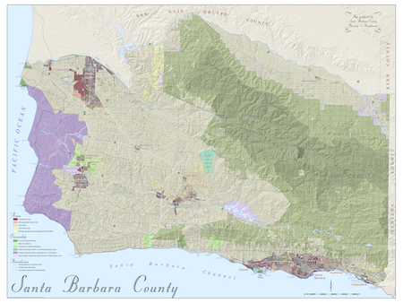

```{r setup, include=FALSE}
knitr::opts_chunk$set(echo = TRUE)
```

## Download Data

Borrowed from [benbestphd.com/landscape-ecology-labs/](http://benbestphd.com/landscape-ecology-labs/) since original downloads not working at [County of Santa Barbara GIS Spatial Catalog](http://cosb.countyofsb.org/central.aspx?id=2802&terms=gis%20data):

- [`data/cosb.countyofsb.org/`](https://github.com/SustainSB/sustainsb.github.io/tree/master/data/cosb.countyofsb.org):
    - `city_boundary_no_ocean.shp`
    - `county_bnd.shp`

## Create Regions

Create regions from city boundaries and the county remainder (ie `city`="Outside Cities"). The spatial file will be output to  [`data/regions.geojson`](https://github.com/SustainSB/sustainsb.github.io/blob/master/regions.geojson).

```{r prep, message=F}
library(tidyverse)
library(sf)
library(sp)
library(rgeos)
library(maptools)
library(geojsonio)
library(leaflet)

regions_csv  = 'layers/regions.csv'
regions_json = 'data/regions.geojson'
cities_shp   = 'data/cosb.countyofsb.org/city_boundary_no_ocean.shp'
county_shp   = 'data/cosb.countyofsb.org/county_bnd.shp'

if (!file.exists(regions_json)){
  
  # read shapefiles
  cities = read_sf(cities_shp) %>% as('Spatial')
  county = read_sf(county_shp) %>% as('Spatial')
  
  # subtract cities from county
  not_cities = county %>%
    gDifference(cities) %>%
    SpatialPolygonsDataFrame(data.frame(city='Outside Cities')) %>% 
    spChFIDs('ID9')

  # fix cities for binding
  cities@data$city = cities@data$CITY
  cities@data = subset(cities@data, select=city)
  row.names(cities@data) = row.names(cities)
  
  # regions: bind cities and not cities
  regions = spRbind(cities, not_cities)
  
  # add region id
  regions@data$region_id = 1:9
  
  # calculate area
  sqft_to_acres = 1/43560
  regions@data$area_acres = gArea(regions, byid=T) * sqft_to_acres
  
  # write layer
  write_csv(regions@data, regions_csv)
  
  # write regions to geosjon
  geojson_write(regions, file=regions_json, convert_wgs84=T)
}
```

Created:

- [`layers/regions.csv`](https://github.com/SustainSB/sustainsb.github.io/blob/master/layers/regions.csv)
- [`data/regions.geojson`](https://github.com/SustainSB/sustainsb.github.io/blob/master/data/regions.geojson)

<script src="https://embed.github.com/view/geojson/SustainSB/sustainsb.github.io/master/data/regions.geojson?height=420&width=620"></script>

## Map of Regions

Let's show a prettier map of the regions:

```{r map}
# read regions from geojson file
regions = geojson_read(regions_json, what='sp')

# setup color palette and labels
pal = colorNumeric('Spectral', regions$region_id, reverse=F)
labels <- sprintf(
  "%d: <strong>%s</strong><br/>",
  regions$region_id, regions$city) %>% 
  lapply(htmltools::HTML)

# show interactive map
leaflet(regions) %>%
  # http://leaflet-extras.github.io/leaflet-providers/preview/
  addProviderTiles(providers$Stamen.TonerLite) %>% 
  addPolygons(
    fillColor = ~pal(region_id),
    fillOpacity = 0.5,
    color = ~pal(region_id),
    opacity = 0.7,
    weight = 2,
    highlight = highlightOptions(
      fillOpacity = 0.7,
      weight = 5,
      opacity = 0.9,
      bringToFront = TRUE),
    label = labels,
    labelOptions = labelOptions(
      style = list("font-weight" = "normal", padding = "3px 8px"),
      textsize = "15px",
      direction = "auto"))
```

## Table of Regions

Show table of regions.

```{r}
library(DT)

regions@data %>% datatable()

```

## Alternative Regions

This [Detailed County Map (3´ x 4´)](http://sbcountyplanning.org/pdf/maps/BaseMaps/County%20Base%20for%203'x4'_updated_2016_12_22_150dpi.pdf) from [Santa Barbara County Planning and Development - Maps and Imagery - Recently Added or Updated](http://sbcountyplanning.org/forms/maps/index.cfm?id=new) has some interesting political / administrative criteria for considering alternative regions:

- Areas:
    - Incorporated City
    - Unincorporated Urban Area
    - Rural Area
    - Inner-Rural Area
    - Existing Developed Rural Neighborhood (EDRN)
- Ownership:
    - County of Santa Barbara
    - State of California
    - University of California Regents
    - Federal ownership within Los Padres National Forest
    - Federal ownership within Vandenberg Air Force Base
    - Other Federal Ownership (BLM, Bureau of Reclamation, etc.)

[](http://sbcountyplanning.org/pdf/maps/BaseMaps/County%20Base%20for%203'x4'_updated_2016_12_22_150dpi.pdf)

